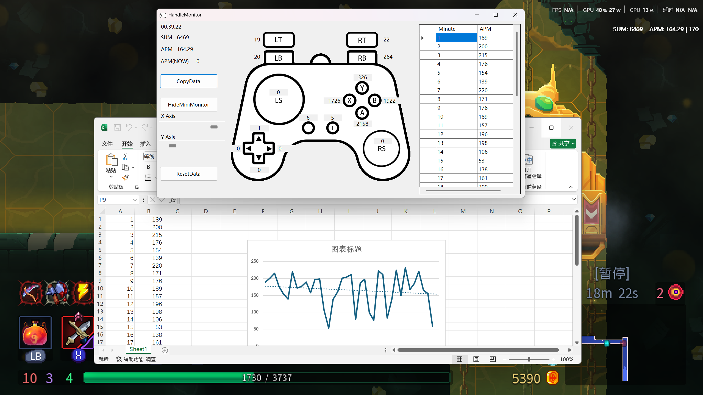

# HandleAPMMontior
## 1.Functions

1.1 Identify the handle Automatically ，count the operation times, APM.

1.2 Use the ***CopyData*** button to export data for recording and statistics.

1.3 Use ***MiniMonitor*** to detect handle operations in real time.

1.4 Use ***ResetData***, reset data.

## 2.Directions

2.1 Based on Microsoft XInput1_4.dll Api, so it will not support Switch and DS4 game handle, and other handles which do not support XInput1_4.dll.

2.2 Only one controller can be recognized, even if open multiple this app.

## 1.功能

1.1 自动识别手柄，记录操作总次数和每分钟操作数。

1.2 使用***CopyData***按钮，复制数据用于记录和统计。

1.3 使用***MiniMonitor***按钮，打开迷你监视器查看实时数据。

1.4 使用***ResetData***按钮，重置统计数据。

## 2.说明

2.1 基于微软XInput1_4.dll Api，所以不支持Switch和DS4手柄，及其它不支持XInput1_4.dll的手柄。

2.2 只能识别一个手柄，软件多开也不行。

